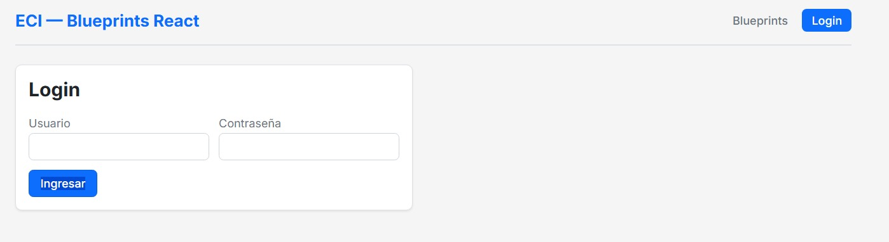
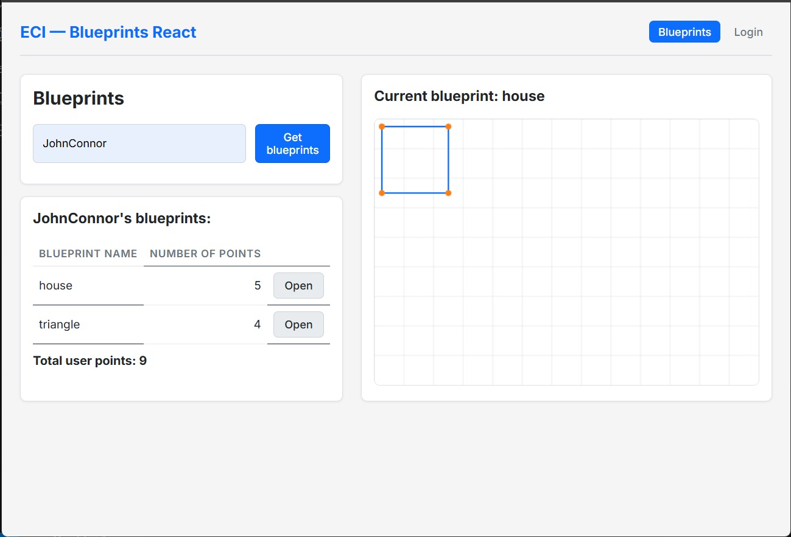
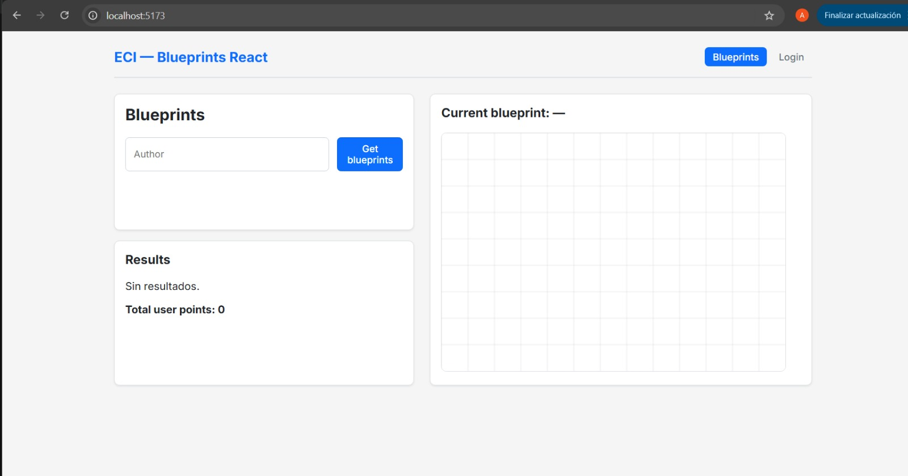

# Laboratorio - React Client for Blueprints

**Escuela Colombiana de Ingenieria Julio Garavito**
**Arquitectura de Software -- ARSW**

Aplicacion SPA desarrollada con **React 18 + Vite**, **Redux Toolkit**, **Axios** (con interceptores JWT), **React Router** y pruebas automatizadas con **Vitest + Testing Library**.

Este frontend consume las APIs REST de Blueprints implementadas en los laboratorios anteriores (Labs 3 y 4), incluyendo autenticacion con JWT.

---

## Tabla de Contenidos

1. [Requisitos previos](#requisitos-previos)
2. [Instalacion y ejecucion](#instalacion-y-ejecucion)
3. [Variables de entorno](#variables-de-entorno)
4. [Estructura del proyecto](#estructura-del-proyecto)
5. [Arquitectura y diseno](#arquitectura-y-diseno)
6. [Funcionalidades implementadas](#funcionalidades-implementadas)
7. [Capa de servicios](#capa-de-servicios)
8. [Gestion de estado con Redux](#gestion-de-estado-con-redux)
9. [Autenticacion JWT](#autenticacion-jwt)
10. [Pruebas automatizadas](#pruebas-automatizadas)
11. [Integracion continua](#integracion-continua)
12. [Scripts disponibles](#scripts-disponibles)
13. [Endpoints consumidos](#endpoints-consumidos)
14. [Docker](#docker)
15. [Repositorios relacionados](#repositorios-relacionados)

---

## Requisitos previos

- Node.js 18 o superior
- npm
- Backend de Blueprints corriendo (Labs 3 y 4) si se desea usar la API real

---

## Instalacion y ejecucion

```bash
git clone https://github.com/AnaFiquitiva/Lab_P3_BluePrints_React_UI.git
cd Lab_P3_BluePrints_React_UI
npm install
cp .env.example .env
npm run dev
```

Abrir `http://localhost:5173` en el navegador.

Por defecto, la aplicacion arranca en **modo mock** (`VITE_USE_MOCK=true`), lo que permite usarla sin necesidad de tener el backend corriendo.

---

## Como probar la funcionalidad (Modo Mock)

Dado que la aplicacion inicia por defecto con datos de prueba, la revision puede hacerse completamente sin el backend:

1. **Buscar planos de un autor:**
   - En el campo "Author" escribir `JohnConnor` (o `SarahConnor`).
   - Hacer clic en **"Get blueprints"**. Aparecera una tabla con los planos disponibles.
2. **Dibujar un plano en el Canvas:**
   - En la tabla de resultados, hacer clic en el boton **"Open"** de cualquier plano.
   - El plano se dibujara automaticamente en el lienzo de la derecha.
3. **Probar Autenticacion y Rutas Protegidas:**
   - Hacer clic en **"Login"** en el menu superior.
   - En modo mock, puede ingresar **cualquier usuario y contrasena**.
   - Al iniciar sesion mediante esta simulacion, se activara el acceso a la ruta privada y aparecera la opcion **"Crear"** en el menu de navegacion.
   - Al entrar a "Crear", se puede probar la interaccion de hacer clics en el lienzo para dibujar nuevos puntos.

---

## Variables de entorno

El archivo `.env` en la raiz del proyecto contiene las siguientes variables:

| Variable | Descripcion | Valor por defecto |
|---|---|---|
| `VITE_API_BASE_URL` | URL base de la API REST del backend | `http://localhost:8080/api` |
| `VITE_USE_MOCK` | Activa (`true`) o desactiva (`false`) el servicio mock | `true` |

Para conectar con el backend real, editar `.env`:

```env
VITE_API_BASE_URL=http://localhost:8080/api
VITE_USE_MOCK=false
```

---

## Estructura del proyecto

```
blueprints-react-lab/
├── src/
│   ├── components/
│   │   ├── BlueprintCanvas.jsx      # Lienzo canvas 520x360
│   │   ├── BlueprintForm.jsx        # Formulario de creacion (JSON)
│   │   ├── BlueprintList.jsx        # Lista de blueprints en tarjetas
│   │   └── PrivateRoute.jsx         # Ruta protegida por JWT
│   ├── features/
│   │   ├── auth/
│   │   │   └── authSlice.js         # Slice de autenticacion (login/logout)
│   │   └── blueprints/
│   │       └── blueprintsSlice.js   # Slice principal (thunks + selectors)
│   ├── pages/
│   │   ├── BlueprintsPage.jsx       # Pagina principal (buscar, tabla, canvas)
│   │   ├── BlueprintDetailPage.jsx  # Detalle de un blueprint por ruta
│   │   ├── CreateBlueprintPage.jsx  # Creacion interactiva (clic en canvas)
│   │   ├── LoginPage.jsx            # Inicio de sesion
│   │   └── NotFound.jsx             # Pagina 404
│   ├── services/
│   │   ├── apiClient.js             # Instancia Axios + interceptores JWT
│   │   ├── apimock.js               # Servicio mock (datos en memoria)
│   │   ├── apireal.js               # Servicio API real (wrapper Axios)
│   │   └── blueprintsService.js     # Conmutador mock/real via VITE_USE_MOCK
│   ├── store/
│   │   └── index.js                 # Configuracion del store Redux
│   ├── App.jsx                      # Rutas y navegacion
│   ├── main.jsx                     # Punto de entrada
│   └── styles.css                   # Estilos globales (dark theme)
├── tests/
│   ├── setup.js                     # Mock de canvas + jest-dom
│   ├── BlueprintCanvas.test.jsx     # Test de renderizado del canvas
│   ├── BlueprintForm.test.jsx       # Test de envio de formulario
│   ├── BlueprintsPage.test.jsx      # Test de interacciones Redux
│   └── blueprintsSlice.test.jsx     # Test de reducers puros
├── .github/workflows/ci.yml         # Pipeline CI (lint + test + build)
├── .env.example                     # Variables de entorno de referencia
├── Dockerfile                       # Build multi-stage para produccion
├── docker-compose.yml               # Compose front + backend
├── eslint.config.js                 # ESLint 9 (Flat Config)
├── vitest.config.js                 # Configuracion de Vitest
├── vite.config.js                   # Configuracion de Vite
└── package.json
```

---

## Arquitectura y diseno

La aplicacion sigue una arquitectura basada en capas:

```
Componentes (UI)
      |
   Paginas (composicion de componentes)
      |
   Redux Store (estado global: slices + thunks)
      |
   Capa de Servicios (blueprintsService.js)
      |
   apimock.js  <-->  apireal.js (apiClient.js + Axios)
```

**Principios aplicados:**

- Componentizacion: cada pieza de la UI es un componente reutilizable
- Separacion de responsabilidades: servicios, estado y UI en capas independientes
- Estado global gestionado exclusivamente via Redux (sin manipulacion directa del DOM)
- Conmutacion de servicios mediante una unica variable de entorno

---

## Funcionalidades implementadas

### 1. Canvas (lienzo)

- Componente `BlueprintCanvas` que renderiza un elemento `<canvas>` HTML5 de 520x360 pixeles
- Dibuja una grilla de fondo como referencia visual
- Representa los puntos de un blueprint como circulos amarillos
- Conecta los puntos con segmentos de recta consecutivos en color azul claro
- Se reutiliza en la pagina principal, detalle y creacion

### 2. Listar planos de un autor

- Campo de entrada para ingresar el nombre de un autor
- Boton "Get blueprints" que despacha un thunk para consultar los planos
- Soporte para busqueda con tecla Enter
- Tabla de resultados con tres columnas:
  - Nombre del plano
  - Numero de puntos
  - Boton "Open"
- Total de puntos del autor calculado con `useMemo`

### 3. Seleccionar un plano y graficarlo

- Al hacer clic en "Open", se despacha `fetchBlueprint` que obtiene el blueprint completo
- El estado global `current` se actualiza con el blueprint seleccionado
- El nombre del plano actual se muestra en la seccion del canvas ("Current blueprint: ...")
- El canvas se redibuja automaticamente con los puntos y segmentos del plano

### 4. Capa de servicios con conmutacion

- `apimock.js`: retorna datos de prueba desde un arreglo en memoria con delay simulado (300ms). Contiene 4 blueprints de 2 autores (JohnConnor, SarahConnor)
- `apireal.js`: consume la API REST real mediante Axios
- Ambos servicios comparten la misma interfaz con cuatro metodos:
  - `getAll()` -- obtiene todos los blueprints
  - `getByAuthor(author)` -- filtra por autor
  - `getByAuthorAndName(author, name)` -- obtiene un blueprint especifico
  - `create(blueprint)` -- crea un nuevo blueprint
- `blueprintsService.js` importa uno u otro segun `import.meta.env.VITE_USE_MOCK`

### 5. Interfaz React con estado global

- El nombre del plano actual se almacena en `state.blueprints.current` (Redux)
- Todos los datos se muestran mediante componentes React con `useSelector` y `useDispatch`
- No se manipula el DOM directamente en ningun punto del codigo

### 6. Estilos

- Tema oscuro (dark mode) con paleta de colores coherente via CSS custom properties
- Tipografia profesional con Google Fonts (Inter)
- Animaciones de hover en botones, tarjetas y filas de tabla
- Spinner animado para estados de carga
- Efectos de foco en campos de entrada con sombra azul
- Diseno responsive con media query para pantallas menores a 768px
- Gradiente en el titulo del header

### 7. Pruebas unitarias

Se implementaron 12 pruebas distribuidas en 4 archivos:

| Archivo | Pruebas | Que valida |
|---|---|---|
| `BlueprintCanvas.test.jsx` | 1 | Renderizado del canvas y llamada a `getContext` |
| `BlueprintForm.test.jsx` | 2 | Envio de formulario con puntos parseados; alerta con JSON invalido |
| `BlueprintsPage.test.jsx` | 3 | Dispatch de `fetchByAuthor`; renderizado con datos; error banner |
| `blueprintsSlice.test.jsx` | 6 | Estado inicial; `clearError`; `pending`/`fulfilled` de 3 thunks |

Configuracion de tests:
- `vitest.config.js` con `globals: true`, entorno `jsdom`
- `tests/setup.js` con mock completo de `HTMLCanvasElement.prototype.getContext` e importacion de `@testing-library/jest-dom`

---

## Capa de servicios

### Conmutacion mock / API real

```
.env                          blueprintsService.js
─────────────────             ─────────────────────
VITE_USE_MOCK=true   ──────>  import apimock
VITE_USE_MOCK=false  ──────>  import apiclient (apireal.js)
```

El modulo `blueprintsService.js` actua como punto unico de acceso. El `blueprintsSlice.js` importa unicamente este modulo, por lo que cambiar de mock a real requiere editar una sola linea en `.env`.

### Interceptores Axios (apiClient.js)

- **Request interceptor**: agrega automaticamente el header `Authorization: Bearer <token>` si existe un token en `localStorage`
- **Response interceptor**: si el servidor responde con `401 Unauthorized`, elimina el token almacenado

---

## Gestion de estado con Redux

### Store

```javascript
{
  blueprints: {
    authors: [],        // Lista de autores unicos
    byAuthor: {},       // Blueprints indexados por autor
    current: null,      // Blueprint seleccionado actualmente
    status: 'idle',     // 'idle' | 'loading' | 'succeeded' | 'failed'
    error: null         // Mensaje de error
  },
  auth: {
    token: null,        // JWT almacenado
    username: null,     // Usuario autenticado
    status: 'idle',
    error: null
  }
}
```

### Thunks (acciones asincronas)

| Thunk | Endpoint | Descripcion |
|---|---|---|
| `fetchAuthors` | `getAll()` | Obtiene todos los blueprints y deriva autores unicos |
| `fetchByAuthor` | `getByAuthor(author)` | Obtiene blueprints de un autor |
| `fetchBlueprint` | `getByAuthorAndName(author, name)` | Obtiene un blueprint especifico |
| `createBlueprint` | `create(payload)` | Crea un nuevo blueprint |
| `login` | `POST /auth/login` | Autentica y almacena el token JWT |

Todos los thunks gestionan tres estados: `pending`, `fulfilled` y `rejected`.

### Selectors memoizados

- `selectAllByAuthor(author)`: selector factory que retorna blueprints de un autor
- `selectTop5ByPoints`: retorna los 5 blueprints con mas puntos, ordenados descendientemente

---

## Autenticacion JWT

### Flujo de autenticacion

1. El usuario navega a `/login` e ingresa credenciales
2. Se despacha el thunk `login` que hace `POST /auth/login`
3. El servidor responde con un token (campo `access_token` o `token`)
4. El token se almacena en `localStorage` y en el estado Redux
5. El interceptor de Axios agrega el token en cada peticion subsiguiente
6. Al cerrar sesion, se ejecuta `logout` que limpia tanto Redux como `localStorage`

### Rutas protegidas

El componente `PrivateRoute` verifica la existencia del token en el estado Redux:
- Si hay token, renderiza el componente hijo
- Si no hay token, redirige automaticamente a `/login`

La ruta `/create` esta protegida de esta manera. La navegacion muestra "Crear" solo si el usuario esta autenticado.

---

## Pruebas automatizadas

Ejecutar las pruebas:

```bash
npm test
```

Resultado esperado:

```
Test Files  4 passed (4)
     Tests  12 passed (12)
```

---

## Integracion continua

El archivo `.github/workflows/ci.yml` define un pipeline que se ejecuta en cada push y pull request:

```
Checkout --> Setup Node 20 --> npm install --> npm run lint --> npm test --> npm run build
```

---

## Scripts disponibles

| Comando | Descripcion |
|---|---|
| `npm run dev` | Inicia el servidor de desarrollo Vite en `http://localhost:5173` |
| `npm run build` | Genera el bundle de produccion en `dist/` |
| `npm run preview` | Sirve el build de produccion localmente |
| `npm run lint` | Ejecuta ESLint sobre todo el proyecto |
| `npm run format` | Formatea el codigo con Prettier |
| `npm test` | Ejecuta todas las pruebas con Vitest |

---

## Endpoints consumidos

Los siguientes endpoints son consumidos por el servicio `apireal.js` cuando `VITE_USE_MOCK=false`:

| Metodo | Ruta | Descripcion | Autenticacion |
|---|---|---|---|
| `GET` | `/blueprints` | Lista todos los blueprints | No |
| `GET` | `/blueprints/{author}` | Blueprints de un autor | No |
| `GET` | `/blueprints/{author}/{name}` | Blueprint especifico | No |
| `POST` | `/blueprints` | Crear un blueprint | JWT requerido |
| `POST` | `/auth/login` | Obtener token JWT | No |

La URL base se configura en `.env` con `VITE_API_BASE_URL`.

---

## Docker

### Build y ejecucion con Docker

```bash
docker build -t blueprints-react .
docker run -p 5173:4173 blueprints-react
```

### Con Docker Compose (front + backend)

```bash
docker compose up
```

Esto levanta el frontend en el puerto 5173 y espera el backend en el puerto 8080.

---

## Repositorios relacionados

| Laboratorio | Repositorio |
|---|---|
| Lab 3 -- REST API Blueprints | [AnaFiquitiva/LAB04_ARSW](https://github.com/AnaFiquitiva/LAB04_ARSW) |
| Lab 4 -- API con seguridad JWT | [AnaFiquitiva/Lab_P2_BluePrints_Java21_API_Security_JWT](https://github.com/AnaFiquitiva/Lab_P2_BluePrints_Java21_API_Security_JWT) |
| Lab 5 -- React Client (este repo) | [AnaFiquitiva/Lab_P3_BluePrints_React_UI](https://github.com/AnaFiquitiva/Lab_P3_BluePrints_React_UI) |

---

## Evidencia

### Imagen 1 — Pagina principal y busqueda de planos por autor

Muestra la pagina principal de la aplicacion con el campo de busqueda por autor. Se ingresa el nombre `JohnConnor` y el sistema retorna la lista de blueprints disponibles junto con el total de puntos del autor.



### Imagen 2 — Visualizacion de un blueprint en el canvas

Se selecciona un plano de la tabla haciendo clic en "Open". El blueprint se renderiza en el lienzo HTML5 con la cuadricula de fondo, los puntos representados como circulos amarillos y las lineas de conexion en azul claro.



### Imagen 3 — Autenticacion y creacion de un nuevo blueprint

Vista de la pagina de login y, tras autenticarse, acceso a la ruta protegida `/create` donde el usuario puede hacer clic sobre el canvas para definir nuevos puntos y crear un blueprint personalizado.



---

## Autor

**Ana Fiquitiva**
Escuela Colombiana de Ingenieria Julio Garavito
Arquitectura de Software -- ARSW
